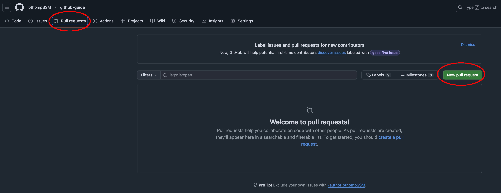
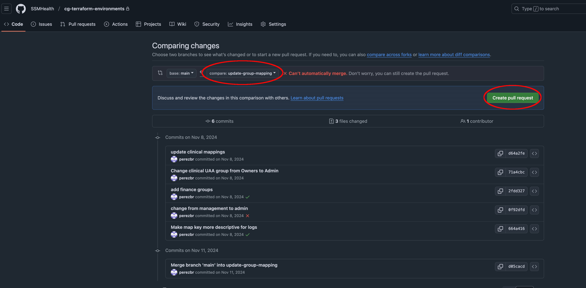
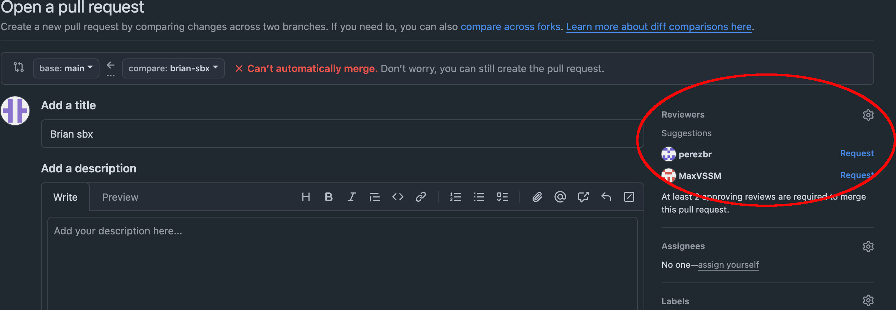

# Basic Git Workflow

This document describes a common Git workflow that you will likely encounter every day.  It will
cover the following topics:

- Cloning a repository
- Creating a branch
- Making changes to a branch
- Committing those changes
- Pushing the changes to the remote repository
- Opening a pull request
- Requesting a code review
- Merging a pull request

This document assumes that you have [Git installed](installing-git.md) on your machine, have it
[configured](configuring-git.md) properly, and have an
[existing repository](../using-github/creating-a-repository.md) to work with in GitHub.

## Cloning the repository

It's typically recommended to clone all of your Git repositories to the same parent directory.  A
good practice is to create a `~/workspace` directory where you can manage all of your projects.
Assuming that we are working with the repository
[https://github.com/SSMHealth/cg-documentation](https://github.com/SSMHealth/cg-documentation),
we can clone it to our local machine by running the following command:

```bash
mkdir ~/workspace
cd ~/workspace
git clone https://github.com/SSMHealth/cg-documentation.git
cd cg-documentation
```

This will create a new directory called `cg-documentation` inside of your `~/workspace` directory.

## Creating a branch

Branches are used to develop features, fix bugs, or experiment with new ideas.  They are a way to
keep your changes separate from the main branch.  The main branch is typically called `main` or
`master`.

To create a new branch, you can use the following command:

```bash
git checkout -b feature/my-feature
```

This will create a new branch called `feature/my-feature` and switch to it.

## Making changes to a branch

Once you have created a branch, you can make changes to the code.  When you make changes, you will
need to stage them and then commit them to the branch.

To stage all of your changes, you can use the following command:

```bash
git add .
```

If you want to stage specific files, you can replace the `.` with the path to the file you want to
stage.  For example, to stage the `README.md` file, you can use the following command:

```bash
git add README.md
```

It's useful to stage your commits in smaller chunks if you want to [write more meaningful commit
messages](./writing-good-commit-messages.md), but it's not required.

## Committing changes

Once you have staged your changes, you can commit them to the branch by running the following
command:

```bash
git commit -m "A meaningful commit message"
```

This will create a new commit with the changes you have staged.  The commit message is a short
description of the changes you made.  It's important to write a meaningful commit message so that
you can easily understand the changes you made later.  See [Writing good commit messages](./writing-good-commit-messages.md)
for more information.

## Pushing changes to the remote repository

Once you have committed your changes, you can push them to the remote repository by running the
following command:

```bash
git push origin feature/my-feature
```

This will push your changes to the `feature/my-feature` branch on the remote repository.

## Opening a pull request

Now that you have pushed your changes to the remote repository, you can open a pull request.  It's
possible to open a pull request from the command line, but it's far more common and easier to do
this through the GitHub web interface.

To open a pull request, you can navigate to the repository on GitHub and click the "Pull requests"
tab.  Then, click the "New pull request" button.





This will open a new pull request with the changes you have pushed to the remote repository.  You
can add a title, description, and any other details you want to include in the pull request.  For
more advanced GitHub users, it's also possible to
[create a pull request template](https://docs.github.com/en/communities/using-templates-to-encourage-useful-issues-and-pull-requests/creating-a-pull-request-template-for-your-repository)
for each repository, which will auto-populate the pull request with a default title, description,
and other details.

## Requesting a code review

Once you have opened a pull request, you can request a code review from another developer.  To do
this, you can click the "Reviewers" button and select the developer you want to review your changes.



This will send a notification and/or email to the developer you selected.  They will then be able
to review your changes and provide feedback.

It's also not a bad idea to message the reviewer(s) on Microsoft Teams, or even better, you can
[create a Teams channel](../misc/creating-a-teams-channel.md) for your team, create a tag for code
reviewers, and then mention the tag in the Teams channel with a link to the pull request.  This will
alert all of the reviewers in a centralized place so that you don't have to message each one
individually.  That way, everyone is on the same page.

## Merging a pull request

Once you have received feedback and approved the pull request, you can merge it into the main branch.


